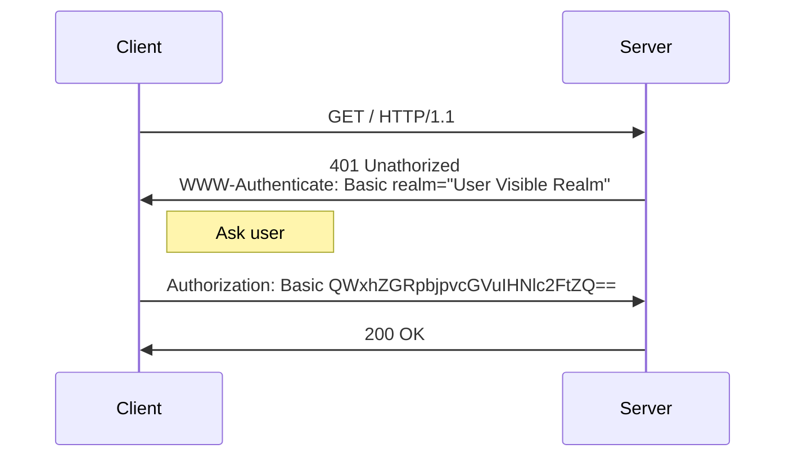

# Authentication and Authorization

WiRL offers a robust and flexible system for handling both authentication and authorization in your API. While it's possible to create custom authentication processes using [filters](filters) and [context injection](context-injection) (see example *12.Context*), WiRL also provides several classes that significantly simplify the developer's work. 

::: tip DEMO
You can find a demo demonstrating how to handle authentication and authorization in the `demo\03.Authorization` folder.
:::

## Understanding Authentication vs. Authorization

Before diving into the implementation details, it's essential to understand the difference between these two concepts:

- **Authentication**: The process of verifying the identity of a user.
- **Authorization**: Determining what actions or resources an authenticated user is allowed to access.

WiRL allows you to manage both aspects seamlessly.

## Configuring Authentication

The `IWiRLConfigurationAuth` interface allows you to set up the basic authentication parameters for your application. Here's an example of a simple configuration:

```pascal
.Plugin.Configure<IWiRLConfigurationAuth>
  .SetTokenType(TAuthTokenType.JWT)
  .SetTokenLocation(TAuthTokenLocation.Bearer)
  .BackToApp
```

This configuration sets up [JWT](https://jwt.io/) authentication with the token being passed with a Bearer authentication.  The client must send this token in the Authorization header when making requests to protected resources:

```http
Authorization: Bearer <token>
```

However, `IWiRLConfigurationAuth` offers more options for fine-tuning your authentication. Each parameter is set using a corresponding `Set<ParameterName>` function. Here are the key parameters:

### AuthChallenge

The `SetAuthChallenge` method allows you to specify the type of challenge (Basic, Digest, Bearer, or Form) and the authentication realm when the access is denied.

### AuthChallengeHeader

Sets the name of the header where the challenge will be inserted. Default is 'WWW-Authenticate'.

### TokenType

Specifies the type of token to be used. Currently, only JWT is supported.

### TokenLocation

Defines where WiRL should look for the authentication token. Options: Bearer (in Authorization header), Cookie, Header (custom header).

### TokenCustom

When `SetTokenLocation` is set to Header, this specifies the name of the custom header.

## Authentication Process Overview

The authentication process in WiRL primarily consists of two phases:

1. User recognition
2. Role assignment

While WiRL allows you to define these phases manually, it also offers streamlined solutions for common scenarios, such as username/password authentication and JWT (JSON Web Token) role management.

## Standard Authentication Resources

WiRL provides several high-level classes that handle most of the work for standard authentication schemes. Let's explore these options:

### 1. TWiRLAuthBasicResource

Use this class when your authentication is based on [Basic Authentication](https://en.wikipedia.org/wiki/Basic_access_authentication). 



Here's how to implement it:

```pascal
[Path('basic_auth')]
TBasicAuthResource = class(TWiRLAuthBasicResource)
private
  // Injects the custom claims into "Subject" field
  [Context] Subject: TServerClaims;
protected
  function Authenticate(const AUserName, APassword: string): TWiRLAuthResult; override;
end;
```

In this example, `Subject` represents the JWT token. It can be of type `TWiRLSubject` or a derived class if you need custom attributes.

Here's an example implementation of the `Authenticate` method:

```pascal
function TFormAuthResource.Authenticate(const AUserName, APassword: string): TWiRLAuthResult;
begin
  // Replace this with your actual server authentication logic
  Result.Success := SameText(APassword, 'mypassword');
  
  // Assign roles based on the username (replace with your actual role assignment logic)
  if SameText(AUserName, 'admin') or SameText(AUserName, 'paolo') then
    Result.Roles := 'user,manager,admin'.Split([','])
  else
    Result.Roles := 'user,manager'.Split([',']);
  
  // Set JWT claims
  Subject.Expiration := IncSecond(Now(), 30);
  Subject.UserID := AUserName;
  
  // Set custom JWT claims
  Subject.Language := 'it-IT';
end;
```

This method verifies the username and password, sets the appropriate roles, and configures the JWT claims.

### 2. TWiRLAuthFormResource

This class is similar to `TWiRLAuthBasicResource`, but it retrieves the username and password from the HTTP request body, assuming they're in `www-form-urlencoded` format. The `Authenticate` method implementation is similar to the previous example.

### 3. TBodyAuthResource

This class follows the same principle but expects the username and password to be sent in the request body as JSON.

## Custom Authentication

For scenarios that require a completely different authentication system, possibly without using a username and password, you have the flexibility to implement your own solution. It can be helpful to examine the implementation of the classes mentioned above as a reference for creating your custom authentication logic.

## JWT Configuration

For applications using JWT, the `IWiRLConfigurationJWT` interface provides additional configuration options. Here's a basic example:

```pascal
.Plugin.Configure<IWiRLConfigurationJWT>
  .SetClaimClass(TServerClaims)
  .SetAlgorithm(TJOSEAlgorithmId.HS256)
  .SetSecret(TEncoding.UTF8.GetBytes(MySecretKey))
```

This sets up JWT with a custom claims class, using the HS256 algorithm and a specified secret key. Let's explore the available configuration methods:

### VerificationMode

Determines how the token should be processed. Options: `Verify` (default): Fully validate the token; `Deserialize`: Only deserialize the token without validation.

### ClaimClass

Specifies a custom class for JWT claims. Must be derived from `TWiRLSubject`. Default: `TWiRLSubject`.

### Algorithm

Sets the algorithm for generating and verifying JWT tokens. Options include HS256, HS384, HS512, RS256, RS384, RS512, ES256, ES384, ES512, PS256, PS384, PS512.

### Secret
For HMAC-based algorithms (HS256, HS384, HS512). Directly set the secret key as bytes or provide a function to generate it.

### PublicKey

For RSA-based algorithms. Sets the public key for token verification.

### PrivateKey

For RSA-based algorithms. Sets the private key for token signing.


## Introduction to WiRL Authorization

WiRL uses a decorator-style approach to define authorization rules. You can apply these decorators at the method level to control access to specific endpoints. Let's look at an example to see how this works in practice:

```pascal
[Path('user')]
TUserResource = class
protected
  // Injects the auth context into the "Auth" object
  [Context] Auth: TWiRLAuthContext;
  // Injects the custom claims into "Subject" object
  [Context] Subject: TServerClaims;
public
  [GET]
  [Produces(TMediaType.APPLICATION_JSON)]
  function PublicInfo: TUserInfo;

  [POST, RolesAllowed('admin,manager')]
  [Produces(TMediaType.APPLICATION_JSON)]
  function InsertUser([BodyParam] AUser: TUserInfo): TUserInfo;

  [GET, Path('/details'), RolesAllowed('admin')]
  [Produces(TMediaType.APPLICATION_JSON)]
  function DetailsInfo: TDetailsInfo;
end;
```

In this example, we define a `TUserResource` class with three methods, each with different authorization levels:

1. `PublicInfo`: This method has no authorization attributes, making it publicly accessible.
2. `InsertUser`: This method is decorated with `[RolesAllowed('admin,manager')]`, restricting access to users with either the 'admin' or 'manager' role.
3. `DetailsInfo`: This method is decorated with `[RolesAllowed('admin')]`, allowing access only to users with the 'admin' role.

## Available Authorization Attributes

WiRL provides three main attributes for controlling access to your resources:

1. `PermitAll`: This attribute allows access to the decorated method for any authenticated user. It's useful for endpoints that require authentication but don't need role-based restrictions.

2. `DenyAll`: This attribute blocks access to the decorated method for all users, regardless of their authentication status or roles. It's helpful when you want to temporarily disable an endpoint or restrict it entirely.

3. `RolesAllowed`: This attribute allows you to specify one or more roles that are permitted to access the decorated method. You can provide multiple roles as a comma-separated list, as seen in the `InsertUser` method above.

> **ATTENTION**: When a JWT token is sent in a request, WiRL only checks its validity (HMAC or RSA). After that, it verifies if the resource has the aforementioned attributes. It's crucial to remember that WiRL does not verify any claims in the token, not even the expiration. Therefore, if additional checks are necessary, it is recommended to use a [filter](/server/filters). Keep in mind that in filters, you can use [context injection](/server/context-injection), for example, to inject the JWT token for further processing.

## Accessing Authentication Context and Claims

WiRL can [inject](context-injection) authentication-related objects directly into your resource class, giving you access to important information about the current request's authentication status and the authenticated user's claims.

In the example above, we see two protected fields decorated with the `[Context]` attribute:

```pascal
[Context] Auth: TWiRLAuthContext;
[Context] Subject: TServerClaims;
```

1. `Auth: TWiRLAuthContext`: This object contains information about the authentication state of the current request, including details about token validity, token type, and other authentication-related metadata.

2. `Subject: TServerClaims`: This object represents the deserialized token, containing the actual claims of the authenticated user. In this example, we're using a custom `TServerClaims` type, which must be derived from `TWiRLSubject`.

By injecting these objects, you can easily access authentication and user information within your resource methods. This allows you to implement more complex authorization logic beyond simple role-based access control if needed.


